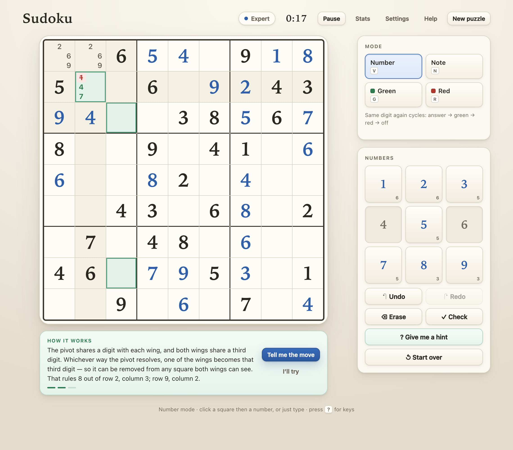

# Sudoku

Sudoku that runs entirely in your browser. Five difficulty levels, coloured pencil-mark
notes, a timer and statistics kept on your own device, and a training section that teaches
the strategies on boards set up to show them.



## Play it

```bash
npm install
npm run dev
```

That starts it at `http://localhost:5173`. To make a copy you can host anywhere (or keep
in a folder and open offline):

```bash
npm run build     # writes a self-contained site to dist/
```

## How to play

Classic Sudoku: fill the grid so every row, every column and every 3×3 box contains the
digits 1 to 9 exactly once. The dark numbers are the puzzle; the blue ones are yours.

There are two ways to enter numbers, and you can switch between them at any time with the
toggle above the keypad:

- **Square first** — tap a square, then a number. The default with a mouse.
- **Number first** — tap a number to pick it up, then tap squares to apply it. The default
  on a phone or tablet: one tap arms the digit and it stays armed, so filling in several
  squares is one tap each instead of a trip back to the keypad every time. The armed number
  also highlights everywhere it already appears, which makes scanning easy.

The answer → green → red → clear cycle works the same in both: in number-first, tapping the
same square again with a number held walks that square through the cycle for that number.

Typing on a keyboard always applies to the selected square, whichever order you're in.

### Choosing a puzzle

Pick a difficulty and you're shown the board *before* you start — its measured difficulty
score, how many numbers you're given, and the hardest tactic it needs. Nothing is timed until
you press **Play this board**, so you can look at a puzzle and ask for a different one at no
cost.

### Notes

Notes are the small digits you pencil into a square while you're working it out. All nine
fit, and they come in three colours:

- **grey** — still possible
- **green** — this could be the answer
- **red** — ruled out (drawn with a line through it, so it reads even if colour is hard
  to distinguish)

The quickest way is to press a digit more than once:

| press `5` | you get |
| --- | --- |
| once | a large **5**, as your answer |
| twice | a green note 5 |
| three times | a red note 5 |
| four times | no 5 note at all |

Each press only ever affects the digit you pressed, so notes build up: `2 2` then `5 5`
leaves you with a green 2 *and* a green 5.

If you'd rather not count presses, there are dedicated modes — **Note**, **Green** and
**Red** — on the panel beside the board, or on the keys `N`, `G` and `R`.

**Your notes are never thrown away.** Putting a number in a square only hides the notes
underneath it, and a small corner mark shows when that's happened. Take the number away
and every note is exactly where you left it. Erase works the same way: the first press
lifts the number, a second clears the notes.

### Skipping the opening bookkeeping

Pencilling every square in at the start of a hard puzzle is the least interesting part of
Sudoku, and it's the part that puts people off practising the strategies that come after
it. So it can be done for you, for a price.

Turn on **Fill in my notes to start** in Settings and every new puzzle opens with the
pencil marks already in. Or leave it off and press **Hint** on a board you haven't touched
yet — a fresh board is one place where the notes are a more useful answer to "help me"
than a single move, so it offers that first, with **Just hint me** if you'd rather have the
move.

What it does is deliberately dim. It reads the numbers printed on the board and nothing
else: for each empty square, which digits its row, column and box still allow. No scanning,
no tactics, nothing from the strategies in Training. Where that leaves a square with a
single digit, there's nothing left to work out, so it's written in as a blue answer.

It runs **one pass only**. Squares that became obvious *because* of what it just wrote in
are left standing — you'll see them, single grey notes dotted about. Those are the easiest
points on the board and they're yours to take. That is the habit this exists to practise.

The cost is **45 seconds, added to the clock up front**, so the time you're watching is
always the true cost of the solve. Nothing else is recorded: it doesn't count as a hint, and
it can't break a clean-solve streak. `Ctrl`+`Z` undoes the whole thing if you change your
mind, though the 45 seconds are spent either way.

How much you're given depends entirely on the board — an Easy puzzle might have ten squares
written in, a Master one usually none at all, because a board that hard has no square down
to one option until you've done some real work on it.

### Checking your work

**Check** marks any square you've filled in that doesn't match the solution. It's free and
you can use it as often as you like — it only counts against the "clean solve" streak in
your statistics if it actually finds a mistake.

Separately, if you place a number that clashes with one already on the board, both squares
flash red for a moment. That only ever compares against numbers already visible, so it
never gives away an answer you haven't found.

## Difficulty

Most Sudoku apps decide difficulty by counting how many numbers they removed. That doesn't
tell you much — a puzzle with few clues can be straightforward, and one with plenty can be
hard.

Here, every generated puzzle is solved by a program that works the way a person does,
trying the simplest tactic that gets anywhere and moving up only when it has to:

| | |
| --- | --- |
| **Easy** | Squares you can fill by simple elimination. Plenty of clues. |
| **Medium** | The same tactics, fewer clues — more hunting before each answer. |
| **Hard** | Needs pairs and locked candidates. You'll want your notes. |
| **Expert** | Triples, quads and wings. Long chains of reasoning. |
| **Master** | The hardest patterns the solver knows. Bring patience. |

How much work that took becomes the puzzle's **score**, and the trickiest tactic it needed
is its **hardest step** — both shown before you start, along with a full list of what the
puzzle requires. If a generated board doesn't match the difficulty you asked for, it's
thrown away and another is made.

**You never have to guess.** Puzzles that can't be finished by reasoning alone are never
offered — not as a first choice, and not as a fallback. Every puzzle has exactly one
solution, and the test suite proves the point by solving one of every difficulty using
nothing but the hint button.

### Hints

If you're stuck, **Give me a hint** (or `H`) tells you what to do next — in three
stages, so asking for help doesn't have to mean being handed the answer:

1. **What to look for** — names the tactic and roughly where, e.g. *"Look for a Pointing
   Pair in the top-left box, involving the digit 5."* Often that's all you need.
2. **How it works** — highlights the squares involved and explains why the tactic is
   valid, so the next one is easier to spot yourself.
3. **The move** — the exact number you can write in, and where.

A hint always ends in a number you can actually place, working forward through however
many deductions that takes. If something you've already written is wrong, the hint says
so first, because nothing else will work out until it's fixed.

Hints never guess. They come from the same solver that rates the puzzles, and they don't
read your notes — so wrong or missing notes can't send them astray.

## Training

**Training**, in the header, is where the strategies themselves are taught — twelve of
them, from the first single up to the swordfish, in the order worth learning them in.

Pick one and the board is set to a position where that strategy is the move, and then
**everything the deduction does not rest on is dimmed out**. For a hidden single that
leaves one house lit, plus the digits elsewhere on the board that do the blocking — the
cross-hatch you would draw by eye. For a swordfish it leaves three rows and three
columns, with only that one digit's candidates drawn and the rest of the board's notes
hidden. What is left on screen is the whole argument and nothing else.

Each lesson then walks through it in three steps, with the board revealing a little more
as you go:

1. **The position** — what is lit, and what question to ask of it
2. **The pattern** — the squares the strategy is about, and the marks that make it
3. **The deduction** — what it proves, with the notes it kills struck through in red

Alongside sits the reasoning in full: what the strategy is, *why it holds* — the actual
proof, not a rule to memorise — and how to go looking for it in your own game. Each
strategy carries three different example boards, so you can see the same shape more than
once. Arrow keys step through, and you can drop into training mid-puzzle and come back to
your game exactly as you left it, clock paused.

The positions are not mock-ups. Each lesson stores a real puzzle, and the app replays it
through the same solver that rates puzzles and gives hints, stopping at the move — so
what you are shown is a position a player would actually reach. The test suite solves
every example outright and checks that what each lesson claims is true: that nothing it
rules out is the right answer, that no square the argument needs has been dimmed, and
that every candidate on screen is honest.

### Starting over

**Start over**, beside the board, offers two choices:

- **Clear my answers** — removes the numbers you've written in and keeps every note,
  including notes hidden under a number
- **Clear my answers and notes** — back to the puzzle exactly as you were given it

Neither touches the puzzle's own numbers, the timer keeps running, and either can be
undone with `Ctrl`+`Z`.

### On a phone

The layout is built so the board and the numbers are on screen together — no scrolling away
from the grid to reach the keypad and back. Number keys and buttons are sized for a thumb,
the mode strip sits directly under the board, and the header collapses to a single row with
the rest behind a menu.

One limitation worth knowing: nine squares across a phone screen caps each square at roughly
40px, short of the 44px usually recommended for touch targets. That is arithmetic rather than
styling — the board would have to be wider than the phone. Number-first input offsets it by
roughly halving the number of taps.

## Statistics

Per difficulty: how many you've solved, your best and average time, and a streak counting
puzzles finished without ever placing a wrong number.

You can switch recording off from the Stats window if you want to play without it counting
— a marker stays in the header while it's off — and you can clear your statistics at any
time.

## Your data

Everything stays in your browser. There is no server and no account, and the game makes no
network requests of its own — you can disconnect and it plays exactly the same. Your times
and statistics are stored locally, and clearing your browser data removes them.

Games in progress are saved automatically, so you can close the tab and pick up where you
left off.

## Keys

Everything is reachable with the mouse; these just make it faster.

| | |
| --- | --- |
| `1`–`9` | Place a number |
| `1`–`9` again | Same digit: answer → green note → red note → nothing |
| `Shift`+`1`–`9` | Straight to a note, without changing mode |
| `V` `N` `G` `R` | Number / Note / Green / Red mode |
| `Space` | Step through the modes |
| `Esc` | Clear mistake highlighting |
| Arrow keys or `WASD` | Move around the board |
| `Backspace` | Lift the number; again to clear the notes under it |
| `C` | Check for mistakes |
| `H` | Ask for a hint |
| `Ctrl`+`Z` / `Ctrl`+`Y` | Undo / redo |
| `P` | Pause |
| `?` | Help |

## Building on it

Plain JavaScript and React, built with Vite. No runtime dependencies beyond React itself.

```
src/
  lib/
    grid.js        rows, columns, boxes and which squares can see which
    solver.js      a fast solver, plus the one that rates difficulty
    generator.js   builds puzzles, measures them, retries until they fit
    worker.js      generation, kept off the main thread
    game.js        the rules of play, with no React in them
    hint.js        finds the next move and explains it in stages
    training.js    replays a puzzle to a teaching position, and explains it
    lessons.js     the example puzzles, found by scripts/find-lessons.mjs
    storage.js     saved games, statistics and settings
  components/      Board, TrainingBoard, SidePanel, HintBar, StartScreen, Preview,
                   Training, Dialogs
test/              checks for the solver, generator, rules, hints and training
```

```bash
npm test
```

Because the rules live apart from the interface, they can be tested directly. The tests
cover puzzle generation and rating, every input rule (including that notes survive a
number being placed on top of them), the opening auto-fill — which writes real answers onto
the board, so it is checked against the solution on a freshly generated puzzle of every
difficulty — and the hint engine — which they check by solving a
puzzle of each difficulty using nothing but hints, verifying every suggested move against
the real solution. The training lessons are checked the same way: every example is solved
outright, and each lesson's claims are held up against the answer.

The example positions are searched for by `node scripts/find-lessons.mjs`, which generates
puzzles until it has clear examples of all twelve techniques and rewrites `src/lib/lessons.js`.
It only needs re-running if you want different examples.

## Licence

MIT — see [LICENSE](LICENSE).
